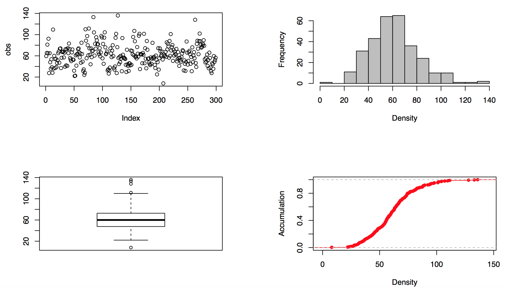
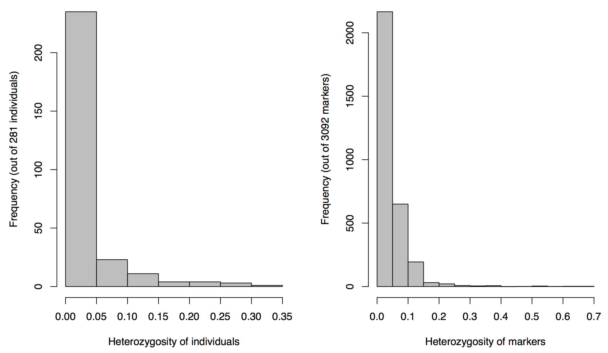
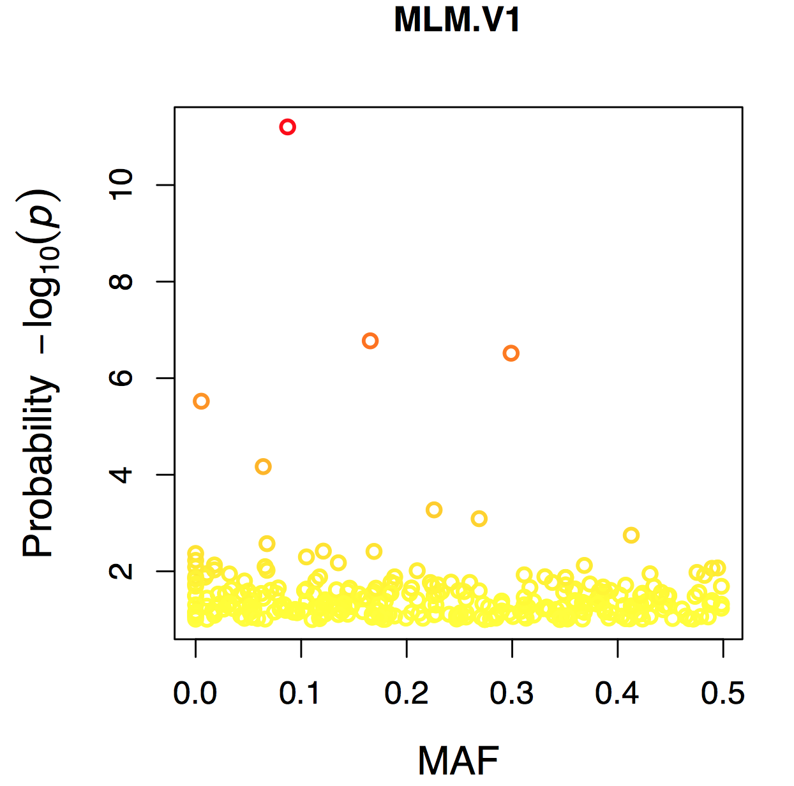
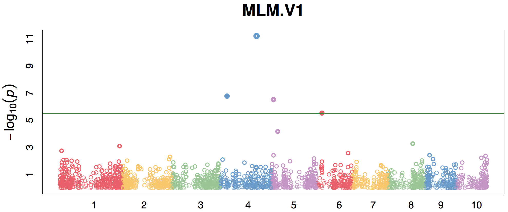
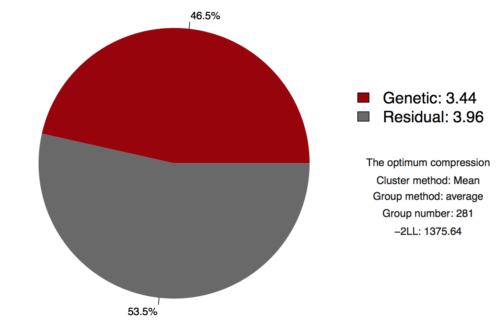

GAPIT3 [](https://github.com/jiabowang/GAPIT3/issues)
===========

Genome Association and Prediction Integrated Tools


Citation
=====

If you use GAPIT and publish your analysis, please report the program version and cite the appropriate article:

  
The citation for GAPIT3 is:    
Wang J., Zhang Z., GAPIT Version 3: Boosting Power and Accuracy for Genomic Association and Prediction, Genomics, Proteomics & Bioinformatics (2021), doi: https://doi.org/10.1016/j.gpb.2021.08.005.

The citation for GAPIT2 is:    
Tang Y., Liu X., Wang J., Li M., Wang Q., et al., 2016 GAPIT Version 2: An Enhanced Integrated Tool for Genomic Association and Prediction. Plant J. 9, https://10.3835/plantgenome2015.11.0120.
  
The citation for GAPIT is:    
Lipka A. E., Tian F., Wang Q., Peiffer J., Li M., et al., 2012 GAPIT: genome association and prediction integrated tool. Bioinformatics 28: 2397–2399, https://doi.org/10.1093/bioinformatics/bts444.

The citation for SUPER method is:    
Wang Q., Tian F., Pan Y., Buckler E. S., Zhang Z., 2014 A SUPER Powerful Method for Genome Wide Association Study (Y Li, Ed.). PLoS One 9: e107684, https://doi.org/10.1371/journal.pone.0107684.

The citation for cBLUP and sBLUP is:    
Wang J., Zhou Z., Zhang Z., Li H., Liu D., et al., 2018 Expanding the BLUP alphabet for genomic prediction adaptable to the genetic architectures of complex traits. Heredity https://doi.org/10.1038/s41437-018-0075-0.

The citation for Farm-CPU is:    
Liu X., Huang M., Fan B., Buckler E. S., Zhang Z., 2016 Iterative Usage of Fixed and Random Effect Models for Powerful and Efficient Genome-Wide Association Studies. PLoS Genet. 12: e1005767. https://doi.org/10.1371/journal.pgen.1005767.

The citation for P3D is:    
Zhang Z., Ersoz E., Lai C. Q., Todhunter R. J., Tiwari H. K., et al., 2010 Mixed linear model approach adapted for genome-wide association studies. Nat. Genet. 42: 355–360. https://doi.org/10.1038/ng.546.


Authors: 
-----

Jiabo Wang and Zhiwu Zhang

Contact:
-----

wangjiaboyifeng@163.com (Jiabo)

Source:
-----

[User manual](http://zzlab.net/GAPIT/gapit_help_document.pdf)

[Demo Data](http://zzlab.net/GAPIT/GAPIT_Tutorial_Data.zip)

[Source code](http://zzlab.net/GAPIT/gapit_functions.txt)

Contents:
-----

   
   * [Start](#start)
      * [Installing GAPIT3](#installing-gapit3)
      * [Data Preparation](#data-preparation)
         * [Phenotype Data](#phenotype-data)
         * [Genotype Data](#genotype-data)
            * [Hapmap Format](#hapmap-format)
            * [Numeric Format](#numeric-format)
   * [Analysis](#analysis)
      * [GWAS](#gwas)
      * [GS](#gs)
   * [Result](#result)
   * [Example](#example)


Start
======


GAPIT is a package that is run in the R software environment.
R can be freely downloaded from [http://www.r-project.org](http://www.r-project.org).
We also recommend the integrated development environment RStudio which is also freely available at [http://www.rstudio.com](http://www.rstudio.com).


## Installing GAPIT3

GAPIT3 can currently be installed in several ways.

- From source on the internet
- From GitHub
- From an archive


### Installation from source at ZZlab

GAPIT can be loaded with a single funciton. 

```      
R> source("http://zzlab.net/GAPIT/GAPIT.library.R")
```


After loading the library, we'll need to source the GAPIT function as well.

```
R> source("http://zzlab.net/GAPIT/gapit_functions.txt")
```

### Installation from GitHub

Installation can also be made from GitHub when the R package `devtools` is available.

```
R> install.packages("devtools")
R> devtools::install_github("jiabowang/GAPIT3",force=TRUE)
R> library(GAPIT3)
```


### Installation from an archive


GAPIT can be installed from an archive such as \*.tar.gz or \*.zip archive.
An archive can be downloaded from the "releases" page.
If you would like the latest version of GAPIT from the GitHub site you may want to clone it and then build it (this may require Rtools on Windows).

```
bash$ git clone git@github.com:jiabowang/GAPIT3.git
bash$ R CMD build GAPIT3
```

Once an archive has been obtained it can be installed from a shell, similar to as follows.


```
bash$ R CMD INSTALL GAPIT3_3.1.0.9000.tar.gz
```

Or similarly from within R.

```
R> install.packages("GAPIT3_3.1.0.9000.tar.gz", repos = NULL, type="source")
```


Data Preparation
-------


### Phenotype Data

The user has the option of performing GWAS on multiple phenotypes in GAPIT. This is achieved by including all phenotypes in the text file of phenotypic data. Taxa names should be in the first column of the phenotypic data file and the remaining columns should contain the observed phenotype from each individual. Missing data should be indicated by either “NaN” or “NA”. 


### Genotype Data

#### Hapmap Format
Hapmap is a commonly used format for storing sequence data where SNP information is stored in the rows and taxa information is stored in the columns. This format allows the SNP information (chromosome and position) and genotype of each taxa to be stored in one file.


#### Numeric Format
GAPIT also accepts the numeric format. Homozygotes are denoted by “0” and “2” and heterozygotes are denoted by “1” in the “GD” file.  Any numeric value between “0” and “2” can represent imputed SNP genotypes. The first row is a header file with SNP names, and the first column is the taxa name.
The “GM” file contains the name and location of each SNP. The first column is the SNP id, the second column is the chromosome, and the third column is the base pair position. As seen in the example, the first row is a header file.


Analysis
======
GWAS
-----

* GLM

The GAPIT uses Least Squares to solve the model.
The GAPIT code for running a GLM is:
      
      myGAPIT_GLM <- GAPIT(
      Y=myY[,c(1,2)],
      GD=myGD,
      GM=myGM,
      model="GLM",
      PCA.total=5,
      file.output=T
      )


* MLM

EMMA method is used in GAPIT, the code of MLM is:

      myGAPIT_MLM <- GAPIT(
      Y=myY[,c(1,2)],
      GD=myGD,
      GM=myGM,
      model="MLM",
      PCA.total=5,
      file.output=T
      )


* CMLM

Compress Mixed Linear Model is published by Zhang in 2010. The code of CMLM is:

      myGAPIT_CMLM <- GAPIT(
      Y=myY[,c(1,2)],
      GD=myGD,
      GM=myGM,
      model="CMLM",
      PCA.total=5,
      file.output=T
      )

* MLMM

Multiple Loci Mixied linear Model is published by Segura in 2012. The code of MLMM in GAPIT is:

      myGAPIT_MLMM <- GAPIT(
      Y=myY[,c(1,2)],
      GD=myGD,
      GM=myGM,
      model="MLMM",
      PCA.total=5,
      file.output=T
      )

* SUPER

Settlement of MLM Under Progressively Exclusive Relation- ship is published by Qishan in 2014. The code of SUPER is:

      myGAPIT_SUPER <- GAPIT(
      Y=myY[,c(1,2)],
      GD=myGD,
      GM=myGM,
      model="SUPER",
      PCA.total=5,
      file.output=T
      )


* Farm-CPU

Fixed and random model Circulating Probability Unification (FarmCPU) is published by Xiaolei in 2016. The code of Farm-CPU in GAPIT is:

      myGAPIT_FarmCPU <- GAPIT(
      Y=myY[,c(1,2)],
      GD=myGD,
      GM=myGM,
      model="FarmCPU",
      PCA.total=5,
      file.output=T
      )


GS
-----

* gBLUP

gBLUP used marker kinship to replace the pedgree relationship matrix. The code is:

      myGAPIT_gBLUP <- GAPIT(
      Y=myY[,c(1,2)],
      GD=myGD,
      GM=myGM,
      model="gBLUP",
      PCA.total=5,
      file.output=T
      )


* cBLUP

cBLUP used group kinship to replace the individual matrix. The code is:

      myGAPIT_cBLUP <- GAPIT(
      Y=myY[,c(1,2)],
      GD=myGD,
      GM=myGM,
      model="cBLUP",
      PCA.total=5,
      file.output=T
      )

* sBLUP

sBLUP used SUPER method to build psedue QTN kinship matrix. The code is:

      myGAPIT_sBLUP <- GAPIT(
      Y=myY[,c(1,2)],
      GD=myGD,
      GM=myGM,
      model="sBLUP",
      PCA.total=5,
      file.output=T
      )


Result
=====

<div align=center>

<div align=center>

<div align=center>

<div align=center>

<div align=center>

<div align=center>

<div align=center>

<div align=center>

<div align=center>

<div align=center>

<div align=center>

<div align=center>

<div align=center>

<div align=center>

<div align=center>

<div align=center>

<div align=center>

<div align=left>


<div align=left> 


Interactive Plots (links):

- [Interactive.Manhattan](http://www.zzlab.net/GAPIT/material/Figure%20S15.Manhattan%20FarmCPU.V1.html)
- [Interactive.QQ](http://www.zzlab.net/GAPIT/material/Figure%20S21.QQ%20FarmCPU.V1.html)
- [Interactive.3D.PCAs](http://www.zzlab.net/GAPIT/material/Figure%20S09.PCA.html)
- [Interactive.GS](http://www.zzlab.net/GAPIT/material/Figure%20S23.GS.html)


   
Example
=====


```
# loading packages for GAPIT and GAPIT functions
source("http://www.zzlab.net/GAPIT/GAPIT.library.R")
source("http://www.zzlab.net/GAPIT/gapit_functions.txt")
# loading data set
myY=read.table(file="http://zzlab.net/GAPIT/data/mdp_traits.txt", head = TRUE)
myGD=read.table("http://zzlab.net/GAPIT/data/mdp_numeric.txt",head=T)
myGM=read.table("http://zzlab.net/GAPIT/data/mdp_SNP_information.txt",head=T)
#myG=read.table(file="http://zzlab.net/GAPIT/data/mdp_genotype_test.hmp.txt", head = FALSE)
# performing simulation phenotype
set.seed(198521)
Para=list(h2=0.7,NQTN=20)
mysimulation<-GAPIT(Para=Para,GD=myGD,GM=myGM)
myY=mysimulation$Y


myGAPIT <- GAPIT(
  Y=myY[,c(1,2)],
  GD=myGD,
  GM=myGM,
  model=c("GLM","MLM","SUPER","MLMM","FarmCPU","Blink"),# choose model
  #model=c("FarmCPU"),
  PCA.total=3,                                          # set total PCAs
  NJtree.group=4,                                       # set the number of clusting group in Njtree plot
  QTN.position=mysimulation$QTN.position,
  Inter.Plot=TRUE,                                      # perform interactive plot
  Multiple_analysis=TRUE,                               # perform multiple analysis
  PCA.3d=TRUE,                                          # plot 3d interactive PCA
  file.output=T
)
```


